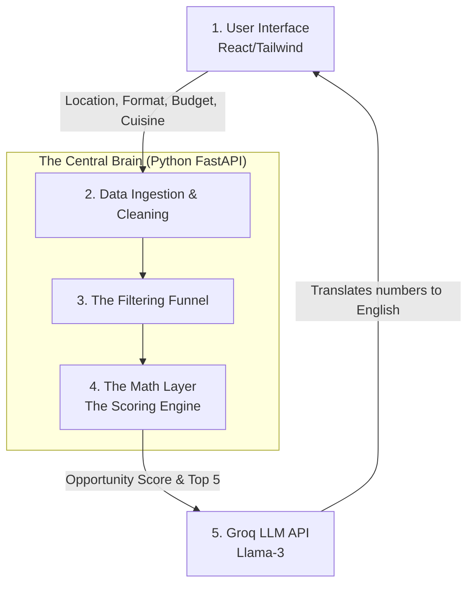
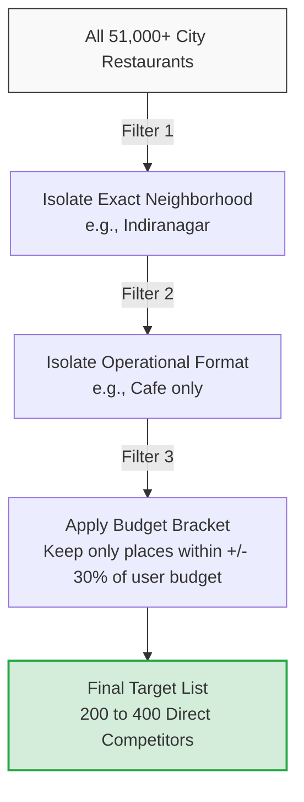
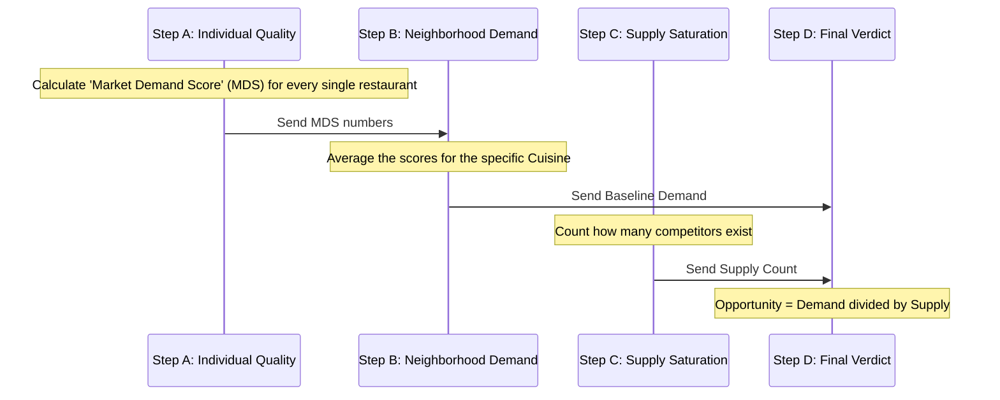

# RestoLaunch AI - Detailed System Architecture

This document outlines the complete system architecture for RestoLaunch AI, designed so that both engineers and non-technical stakeholders can understand exactly how the system works—especially the **Backend Math Layer**, which is the beating heart of the product.

---

## 1. The High-Level Journey
When a user wants to test a restaurant idea, the system moves through a pipeline: capturing the idea, cleaning the data, doing the heavy math, asking an AI for a human summary, and presenting the final verdict.

---

## 2. The Backend Math Layer (The Engine)
*This is the most critical part of the system. If the math fails, the product fails. Here is exactly how we ensure it is bulletproof.*

### A. Data Ingestion & Cleaning (Making the Data Safe)
Before we can do math, we load our static database of 51,000+ restaurants into the server's RAM (Memory) using Python `pandas`. Operating in RAM means calculations happen instantly. 
However, raw internet data is messy. We must "clean" it so the math doesn't crash:
* **Prices:** We remove commas (e.g., `"1,200"` becomes the number `1200`).
* **Ratings:** We convert `"4.2/5"` to `4.2`. If a restaurant is marked as `"NEW"` or `"-"` (meaning no rating yet), we assign a safe default score (like `3.5`) so the system doesn't break.
* **Votes:** If votes are missing, we explicitly set them to `0`.

### B. The Filtering Funnel (Finding the True Competitors)
Comparing a luxury dining space to a cheap street stall will break our demand logic. The system uses a strict funnel to isolate only true competitors.

### C. The 4-Step Scoring Engine
Once we have our target list of 200–400 competitors, we calculate the Opportunity Index (OI). We need to find "Market Vacuums"—places with high consumer demand but very low competitor supply.

**Step-by-Step Breakdown (For Non-Technical Readers):**

#### Step A: Calculate Individual Quality (MDS)
We can't just trust a "5-star rating" if it only has 2 reviews. We combine **Rating** and **Volume (Votes)** to get a true Market Demand Score (MDS).
* **The Math:** `MDS = (Rating × Rating) × Log(Votes + 1)`
* **Why it's bulletproof:** 
  1. We square the rating to exponentially reward truly great food over mediocre food.
  2. We use a logarithm for votes. This means 10,000 votes won't infinitely overshadow 1,000 votes. It smooths out virality.
  3. We add `+1` to the votes because the math function `Log(0)` causes computer systems to crash. `Log(1)` equals `0`, which is safe!

#### Step B: Discover Neighborhood Demand (The Average)
We group all restaurants matching the user's cuisine (e.g., all Italian places in the filtered list) and calculate their average MDS.
* **The Zero-Vote Rule:** If a restaurant has 0 votes (it opened yesterday), we **completely exclude** it from this average. If we included it, its score of `0` would artificially drag the entire neighborhood's demand average down to the floor.
* **The Empty Market Fallback:** What if there are *zero* Italian places in this neighborhood? You can't divide by zero to find an average—that crashes the server. If this happens, the system automatically pulls the **City-Wide Average** for Italian food, ensuring the math survives.

#### Step C: Count the Competitors (Supply)
We simply count how many physical units serve that cuisine in that neighborhood. 
* **Note:** Unlike Step B, we *do* count the 0-vote (brand new) restaurants here. Even if they are new and unproven, they are physically taking up market supply.

#### Step D: Calculate the Final Opportunity Index (OI)
We pit the High Demand (Step B) against the Supply Saturation (Step C).
* **The Math:** `Opportunity Index = Average Demand / SquareRoot(Competitors + 1)`
* **Why it's bulletproof:** We use the Square Root of the competitors. If we just divided normally, the opportunity score would drop by 50% the second a single competitor opened. Using a square root ensures the penalty for a little competition is softened, allowing great markets to shine even if 1 or 2 competitors exist. We add `+1` again to guarantee we never divide by zero.

---

## 3. The Groq API (Turning Math into English)
We now have hard numbers (e.g., an Opportunity Score of `47.5`). But restaurant founders don't want to read math equations. 

We use the **Groq API (Llama-3)** because it is incredibly fast and free. 
1. The backend silently sends Groq a prompt: *"The user wants an Italian Cafe in Indiranagar. The Opportunity Score is 47.5 (High) with only 1 competitor. Give me a 2-sentence business verdict."*
2. Groq instantly replies: *"High Opportunity Market Gap. Indiranagar shows massive validation for Italian cafes, but current supply is heavily unsaturated. A premium offering here has a massive arbitrage advantage."*

## 4. Tech Stack Summary
* **Frontend:** React / Tailwind CSS (Vercel)
* **Backend:** Python / FastAPI (Render/Railway)
* **Data Processing:** Python Pandas (In-Memory RAM Cache)
* **Database (Future Proofing):** PostgreSQL (Supabase)
* **AI Analysis:** Groq API (Llama-3 model)
